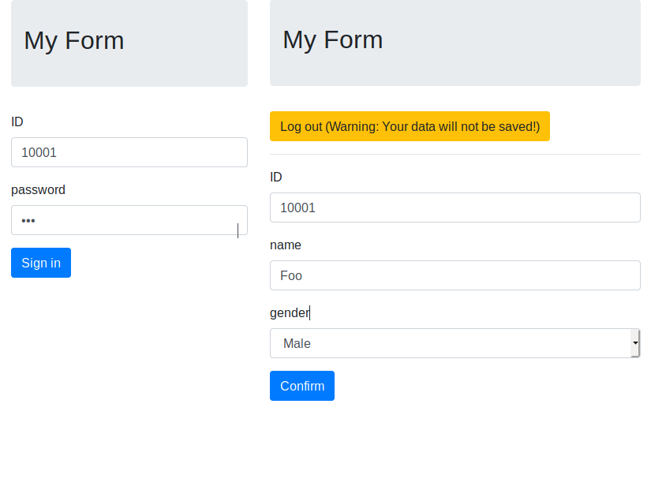

# Formify
Fast-forward web-form generator with access control.

## What does Formify do?
Given an excel file

```
input.xlsx

| ID    | password    | name | ... |
|-------|-------------|------|-----|
| 10001 | $2b$12$E... | Foo  | ... |
| 10002 | $2b$12$R... | Bar  | ... |
| ...   | ...         | ...  | ... |
```

and a form definition

```json
{
  "title": "My Form",
  "idField": "ID",
  "encryption": "bcrypt",
  "passwordField": "password",
  "fields": [
    {
      "fieldName": "name",
      "fieldAlias": "name",
      "type": "text",
      "validations": [{
          "type": "notNull"
      }]
    },
    {
      "fieldName": "gender",
      "fieldAlias": "gender",
      "type": "select",
      "selections": [
        { "text": "Choose one..." },
        { "text": "Male", "value": "male" },
        { "text": "Female", "value": "female" },
        { "text": "Others", "value": "others" }
      ],
      "validations": [{
          "type": "notNull"
      }]
   }
  ]
}
```

and you will have a beautiful web form without struggling!



And you will get another excel as an output when all users submitted their data!

```
output.xlsx

| ID    | password    | name | gender | ... |
|-------|-------------|------|--------|-----|
| 10001 | $2b$12$E... | Foo  | female | ... |
| 10002 | $2b$12$R... | Bar  | male   | ... |
| ...   | ...         | ...  | ...    | ... |
```

## Installation
1. Install python 3.5+. Make sure `python`, `pip`, `virtualenv` are in your envirionment

    - For windows users:
    - For ubuntu users: `apt-get install python3 python3-pip python3-virtualenv`

1. You may want to create a new virtual environment before continue. (You can skip this step)

   `virtualenv -p python3 pyenv`

   and then activate the virtual environment.

   `source pyenv/bin/activate`

1. Install requirements

   `pip install -r requirements.txt`


## Usage
1. Prepare an excel file containing at least 2 columns, one as the username, one as the password.
1. Create a `config.json` file. You can use the example in [What does Formify do?](#what-does-formify-do)

   Detailed explanation of `config.js` are in [configurations](#Configurations).

1. Generate web pages: `python generate.py`
1. Run server: `python server.py`. If you want to stop the server, simply press <Ctrl-C>


## Configurations

```javascript
{
  locale: "en",  // Language to use in the webpage. Currently `en` and `zh` are supported.
  template: "default",  // Template to use in the webpage. Currently only `default` is available.
  inputFile: "./input.xlsx",  // The filename of your excel file, containing ID and password.
  outputFile: "./output.xlsx",  // The filename of the output excel file.
  encryption: "none",  // The encryption method in your password column. One of `none` and `bcrypt`.
  updateTime: true,  // Whether to add `updatedAt` field in the output excel file.
  localAssets: true,  // Whether to use local assets instead of cdn. Helpful when developping locally.
  serverAddress: "/apiv1",  // The server address to access in the webpage.
  title: "Formify Client",  // The title in the webpage.
  idField: "Student ID",  // The name for ID column in the input excel file.
  passwordField: "Password",  // The name for Password column in the input excel file.
  mergeInput: true,  // Whether to merge the input excel file with the output data.
  fields: [  // Objects describing all fields.
    {
      fieldName: "name",  // The column name in the excel. required
      fieldAlias: "name",  // The name used in the web form. required. must be ascii only.
      type: "text",  // The type if the field. One of `text`, `date`, `integer`, `float`, `select`
      validations: [{  // List of validation methods. Currently `regex` and `notNull` are supported.
          type: "regex",
          value: "^[a-zA-Z ]*$"
      }]
    },
    {
      fieldName: "gender",
      fieldAlias: "gender",
      type: "select",
      selections: [  // If type == "select", you should provide a list of {text, value} objects.
        { text: "Choose one..." },
        { text: "Male", value: "male" },
        { text: "Female", value: "female" },
        { text: "Others", value: "others" }
      ],
      validations: [{
          type: "notNull"
      }]
   }]
}
```


## TODOs
1. Add API to reload input excel file
1. Instead of using in-memory storage, generate a sqlite object at first and do queries
1. Implement several password encryptions
1. Securify POST with session or jwt
1. Implement password encryption script (or script generator)
1. Add more validation methods, e.g. min, max
1. Add datetime handling
1. Add nodejs + webpack to bundle javascript file after generation, instead of using the bable in-browser compiler.
